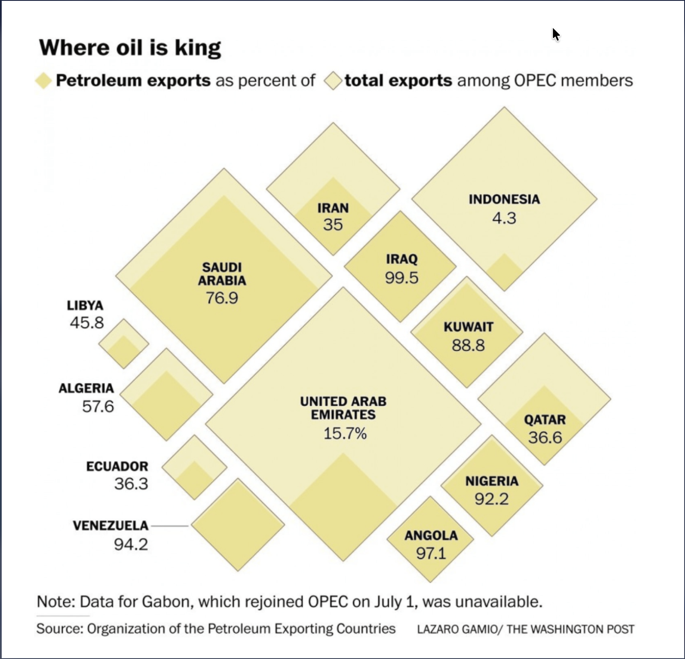
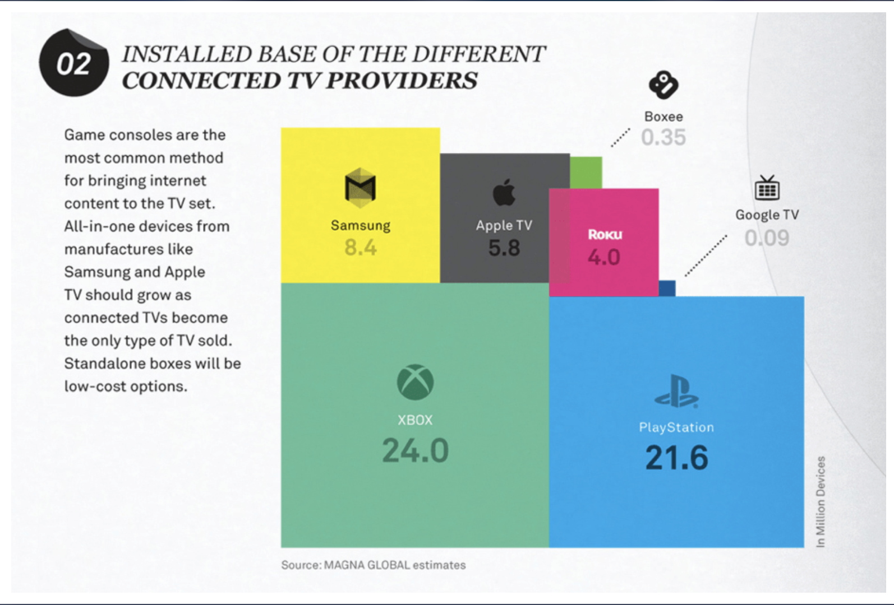

# Data Visualization

## Assignment 2: Good and Bad Data Visualization

### Requirements:

- Data visualizations are important tools for communication and convincing; we need to be able to evaluate the ways that data are presented in visual form to be critical consumers of information 
- To test your evaluation skills, locate two public data visualizations online, one good and one bad  
    - You can find data visualizations at https://public.tableau.com/app/discover or https://datavizproject.com/, or anywhere else you like! 
- For each visualization (good and bad):

My good visualization of choice:
; source: https://www.washingtonpost.com/news/worldviews/wp/2016/08/02/how-the-crash-in-oil-prices-devastated-angola-and-venezuela/?postshare=7121470239927488

My bad visualization of choice:
; source: https://oberhaeuser.info/work


    - Explain (with reference to material covered up to date, along with readings and other scholarly sources, as needed) why you classified that visualization the way you did.
      ```
      Good Visualization - Title: Where oil is king
      The purpose of this visualization is to show both the total exports of OPEC member countries and the proportion of those exports that come from petroleum. I believe that this visualization succeeds because it clearly communicates this while remaining easy to interpret. From the aesthetic perspective, I appreciate the limited colour palette as this made for a clean and professional appearance. The layout is well organized and avoids unnecessary decorative elements that could pose a distration. I think the white space is used effectively. The title also clearly communicates the main message and the labels are easy to read and placed close to relevant data. From a substantive perspective, the visualization effectively communicates the meaningful information about the economic dependence on petrolium exports for the OPEC countries. Only 2 variables are presented here: total exports and petroleum exports (the latter as a percentage of total exports) allowing for the viewer to make the comparison and further understand the economics.  From a perceptual perspective, the visualization effectively uses squares-within-squares (nested appearance) with the larger one representing the total exports and the inner (more shaded) square representing the proportion of exports attributable to petroleum. THis allows for the identification of patterns quickly. For example, coutries like Angola, Iraq and Saudi Arabia have a strong dependence on oil exports. With all this, the visualization imposes low cogintive load in my opinion. The viewer can quickly understand the message and compare countries without searching too deeply or decoding.

      Bad Visualization - Title: Installed base of the different connected TV providers
      The purpose of this visualization is to show how the major connected TV providers compare in terms of the number of devices in use. Indeed, I think this is visually attractive, however I think it prioritizes design over accurate data interpretation. The visualization creates high cognitive load because the viewer must simultaneously process the logos, colours, text labels, varying rectangle sizes, and explanatory text. I myself took quite some time to understand the underlying message since these elements compete for attention. This design requires considerable interpretation before meaningful comparisons can be made. From the substantive perspective, the primary goal appears to be comparing market share among the different providers but the chosen design makes it difficult to rank providers or estimate differences between categories. I think the visualization also raises accessibility concerns. Smaller categories like Google TV or Boxee are difficult to locate and interpret because their corresponding areas are too small. To my eyes, I think some labels have limited contrast against their background, which reduces redability. 


      ```
    - How could this data visualization have been improved?  
      ```
      Good Visualization - Title: Where oil is king
      Although I think this visualization is effective, as discussed in class, it is easier for us to make accurate conclusions when comparing lengths rather than areas. As such, I think some vieweds may struggle making precise comparisons between square sizes. Maybe a bar plot will be more effective and easy to understand. I also think the layout itself has no meaningful ordering as it appears more aesthetically arranged, maybe for more impact, some sort of ordering to these squares could be implemented.

      Bad Visualization - Title: Installed base of the different connected TV providers

      As with the good visualization discussed above, this visualization also relies heavily on area comparisons which is difficult to compare as opposed to using lengths. A simple bar chart would communicate comparisons more effectively than this visualization. I also think that reducing the decorative elements, like the excessive colour variation and logos, would lower the cognitive load. I also think that sorting categories from largest to smallest would facilitate comparison.
      

      ```
- Word count should not exceed (as a maximum) 500 words for each visualization (i.e. 
300 words for your good example and 500 for your bad example)

### Why am I doing this assignment?:

- This assignment ensures active participation in the course, and assesses the learning outcomes
* Apply general design principles to create accessible and equitable data visualizations
* Use data visualization to tell a story

### Rubric:

| Component               | Scoring   | Requirement                                                 |
|-------------------------|-----------|-------------------------------------------------------------|
| Data viz classification and justification | Complete/Incomplete | - Data viz are clearly classified as good or bad<br />- At least three reasons for each classification are provided<br />- Reasoning is supported by course content or scholarly sources |
| Suggested improvements  | Complete/Incomplete | - At least two suggestions for improvement<br />- Suggestions are supported by course content or scholarly sources |

## Submission Information

🚨 **Please review our [Assignment Submission Guide](https://github.com/UofT-DSI/onboarding/blob/main/onboarding_documents/submissions.md)** 🚨 for detailed instructions on how to format, branch, and submit your work. Following these guidelines is crucial for your submissions to be evaluated correctly.

### Submission Parameters:
* Submission Due Date: `23:59 -  2026-06-09`
* The branch name for your repo should be: `assignment-2`
* What to submit for this assignment:
    * This markdown file (assignment_2.md) should be populated and should be the only change in your pull request.
* What the pull request link should look like for this assignment: `https://github.com/<your_github_username>/visualization/pull/<pr_id>`
    * Open a private window in your browser. Copy and paste the link to your pull request into the address bar. Make sure you can see your pull request properly. This helps the technical facilitator and learning support staff review your submission easily.

Checklist:
- [ ] Create a branch called `assignment-2`.
- [ ] Ensure that the repository is public.
- [ ] Review [the PR description guidelines](https://github.com/UofT-DSI/onboarding/blob/main/onboarding_documents/submissions.md#guidelines-for-pull-request-descriptions) and adhere to them.
- [ ] Verify that the link is accessible in a private browser window.

If you encounter any difficulties or have questions, please don't hesitate to reach out to our team via our Slack. Our Technical Facilitators and Learning Support staff are here to help you navigate any challenges.
